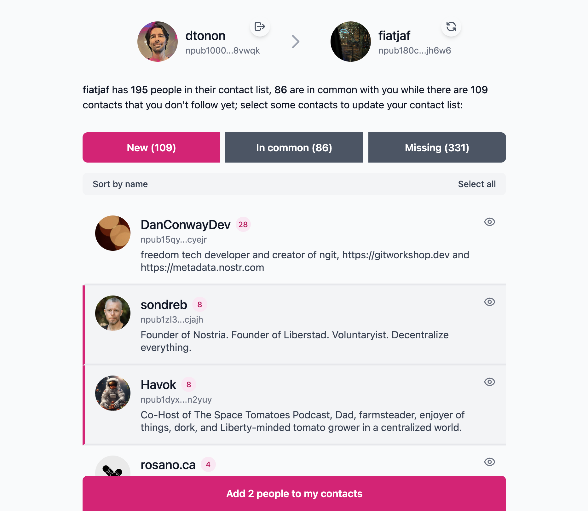

# Yoink

See someone's Nostr following list you like? Yoink it. Compare contacts, discover new people, and grab the best follows with one click.



You can also take inspiration from the "Missing" section and use it to remove useless contacts ;)

## Developing

Once you've created a project and installed dependencies with `npm install` (or `pnpm install` or `yarn`), start a development server:

```sh
npm run dev

# or start the server and open the app in a new browser tab
npm run dev -- --open
```

## Building

To create a production version of your app:

```sh
npm run build
```

You can preview the production build with `npm run preview`.

> To deploy your app, you may need to install an [adapter](https://svelte.dev/docs/kit/adapters) for your target environment.
